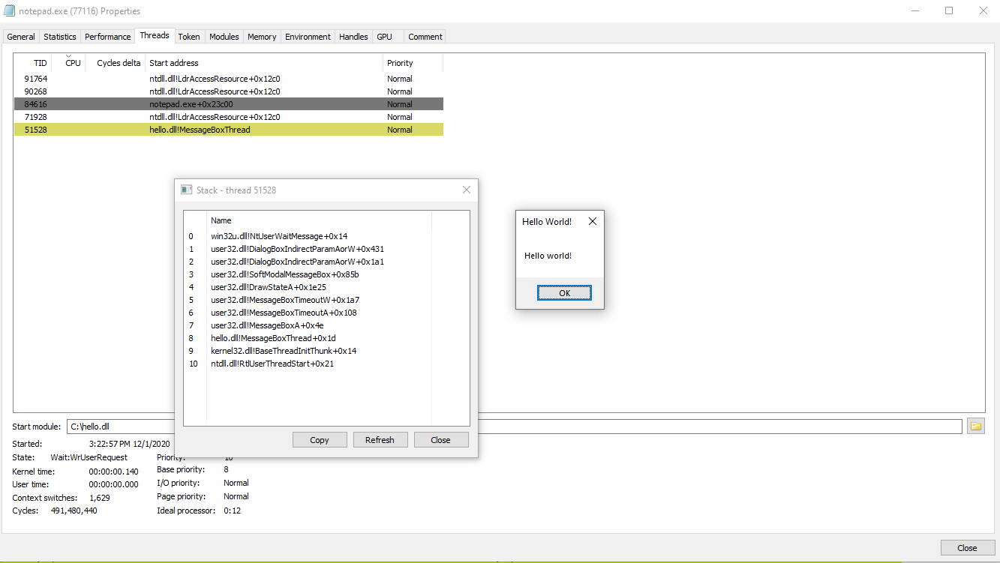

# NimMusings
Musings with Nim as an Offensive language and other stuff too

### BasicInjection.nim
Code borrowed from: https://github.com/byt3bl33d3r/OffensiveNim/blob/master/src/shellcode_bin.nim (Author: Marcello Salvati, Twitter: @byt3bl33d3r) and adapted for standard DLL injection.

## Dependencies: nimble install winim

## Compile: nim compile --app=console --cpu=amd64 BasicInjection.nim

## Usage: 
Arash@DESKTOP-8ETETLV MINGW64 ~/Desktop

$ ./source.exe C:\\hello.dll

[*] Injecting: C:\hello.dll

[*] Target Process: 93048

[*] pHandle: 168

[*] WriteProcessMemory: true

    \-- bytes written: 12
    

[*] tHandle: 196

[+] Injected

